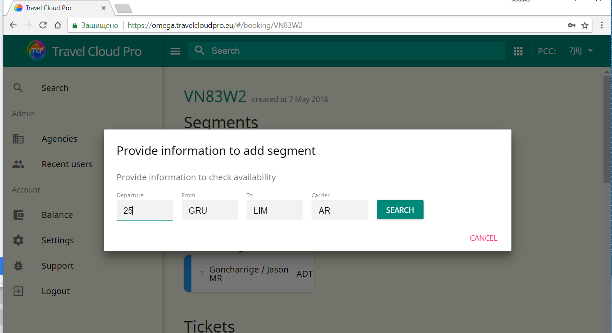
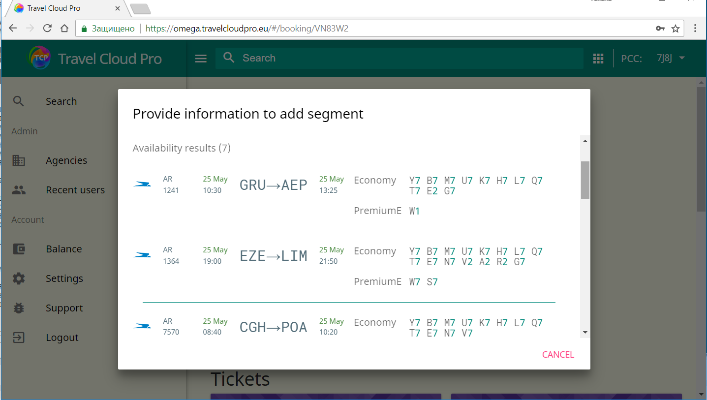
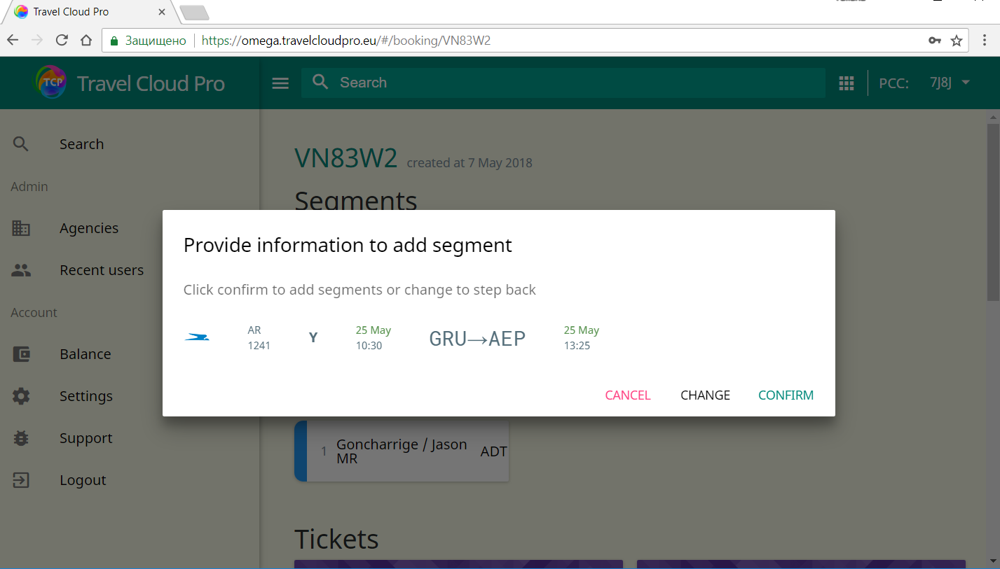
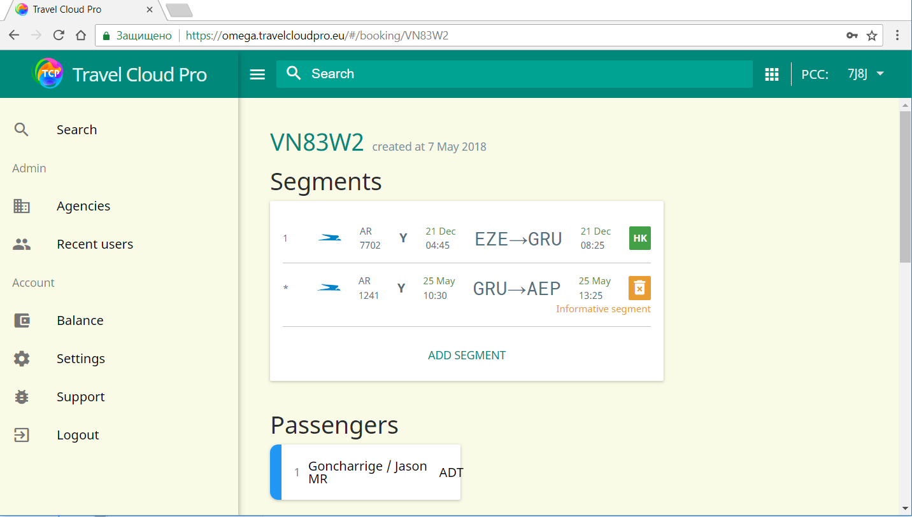
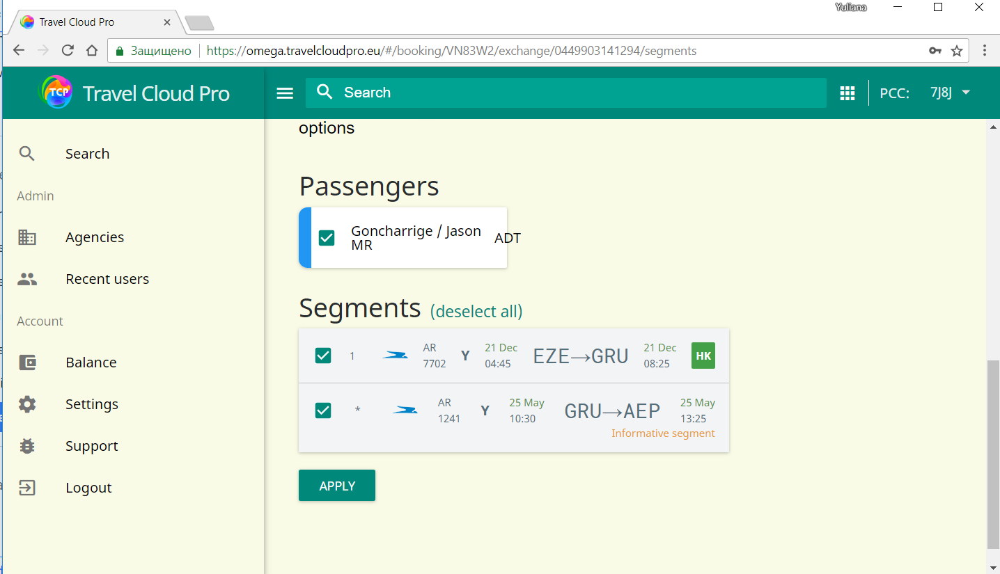
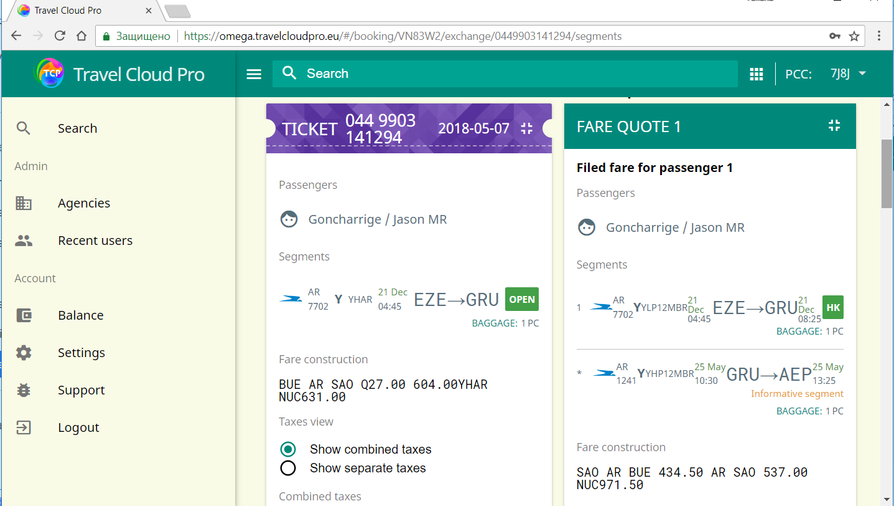

# Add flight segments in TCP

TCP allows to book flight segments temporarily by adding them directly via TCP interface. No extra applications, no GDS terminal entries needed for this task.

1. Provide the basic availability search criteria \(date, origin and destination points, airline\) and press Search button.

2. Select the required flight and booking class

3. Confirm your selection

4. Proceed with exchange process in TCP taking into account newly added segment

5. Newly added flight segment ia taken into account when TCP calculates new fare, but such fare calculation is not saved into PNR

