# Exchange using manual fare quote

## Rerouting using manual fare quote

The passenger originally purchased a ticket to travel from Kyiv to Paris with a connection in Warsaw on 01 SEP and returning back on 11 SEP. Then due to strike on 11 SEP the travel date needs to be changed to 15 SEP. The flight segments have been changed accordingly.

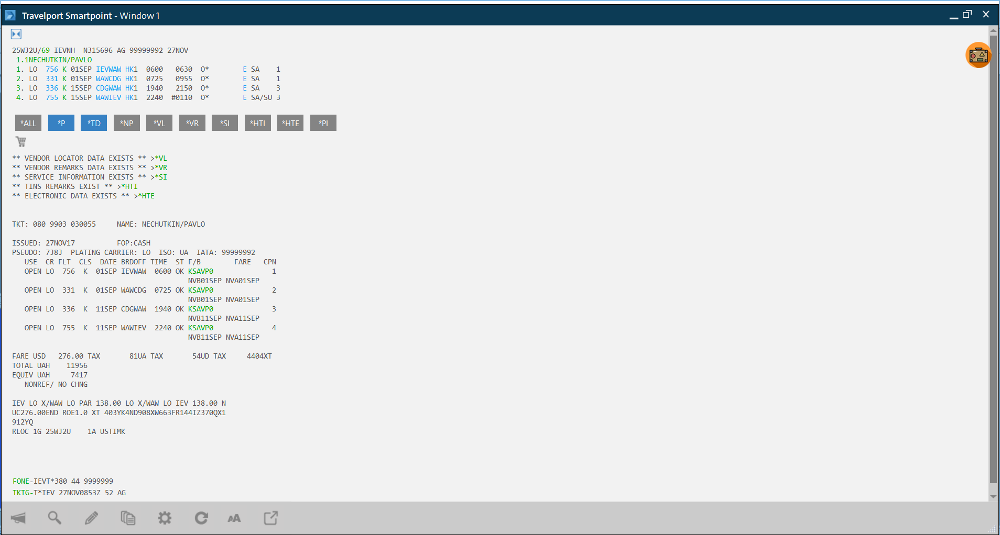

In order to process this rerouting in TCP the following steps should be taken:

1. Open the PNR in TCP by searching either by Record locator or passenger name

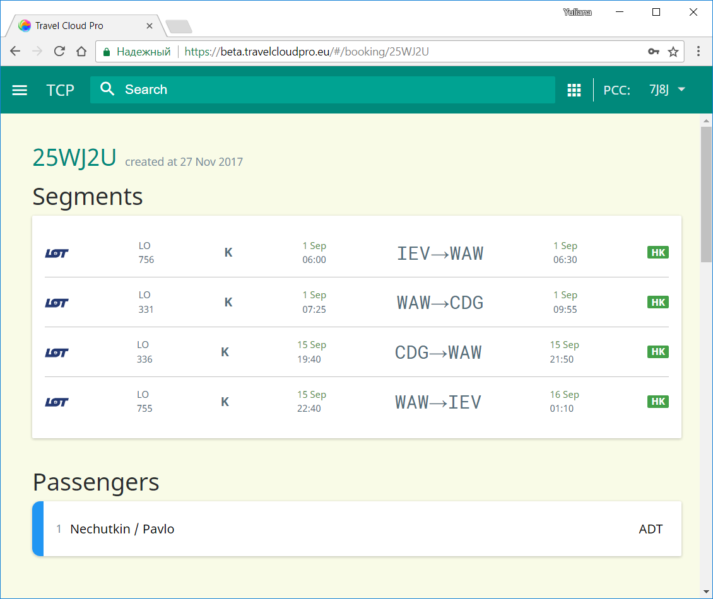

1. Scroll down to display ticket details and Select "Involuntary changes/Manual mask" option

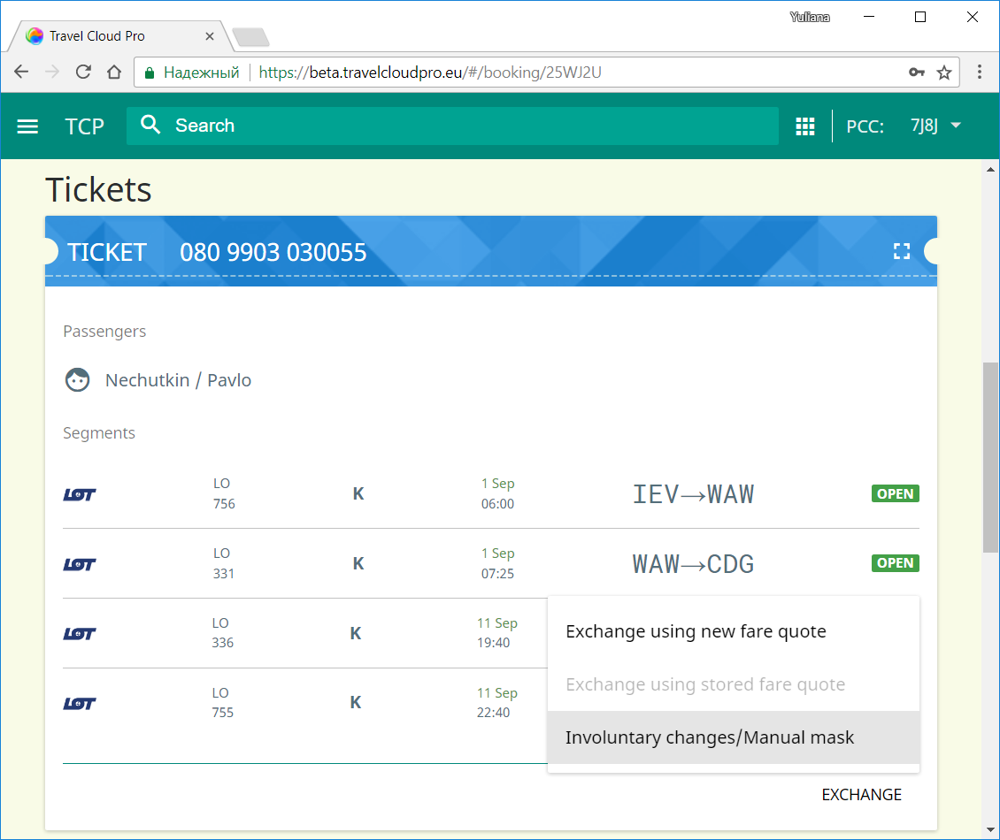

1. Select the segments for exchange and activate the checkboxes "No Stop" to indicate that there is no stopover. The remaining fields for manual fare build mask will be filled in automatically:

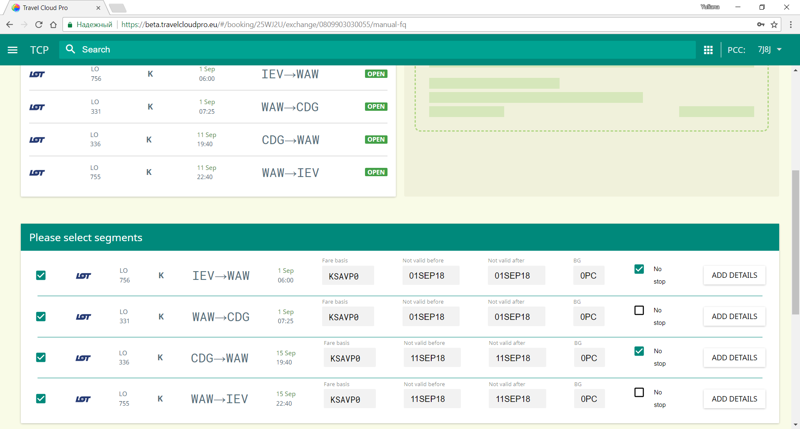

1. Delete all taxes, check calculation details and click "Apply" button

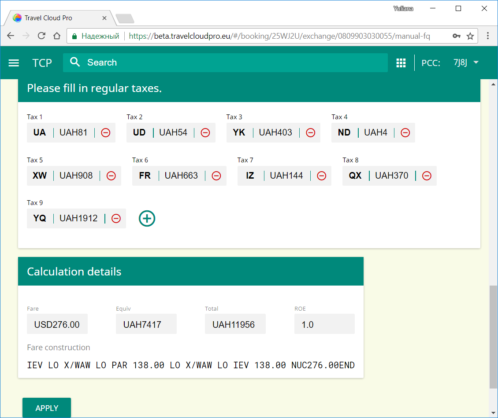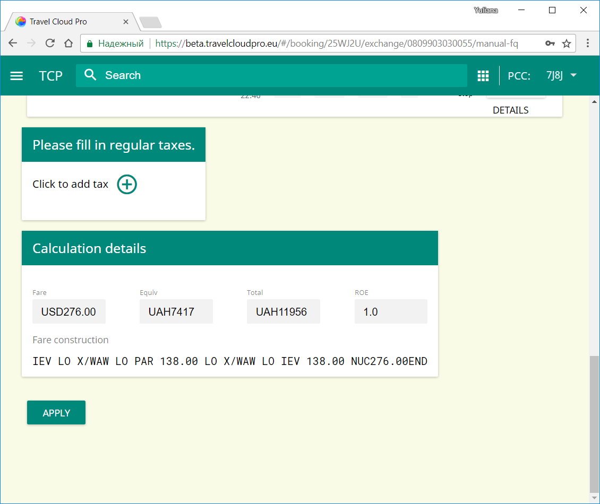

1. Indicate whether some penalty needs to be charged for ticket change, the option "No penalty" is selected by default.

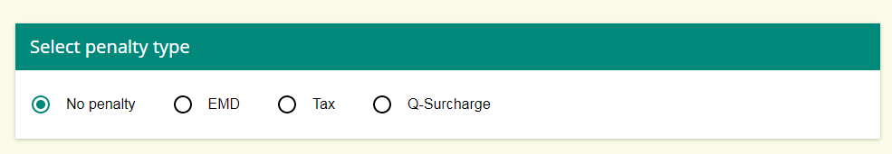If for exchange ticket a different commission applies, TCP allows to indicate it manually by selecting amount or percentage and indicating the commission value

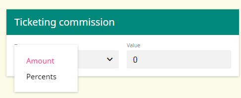

1. Insert endorement text into "Additional options":

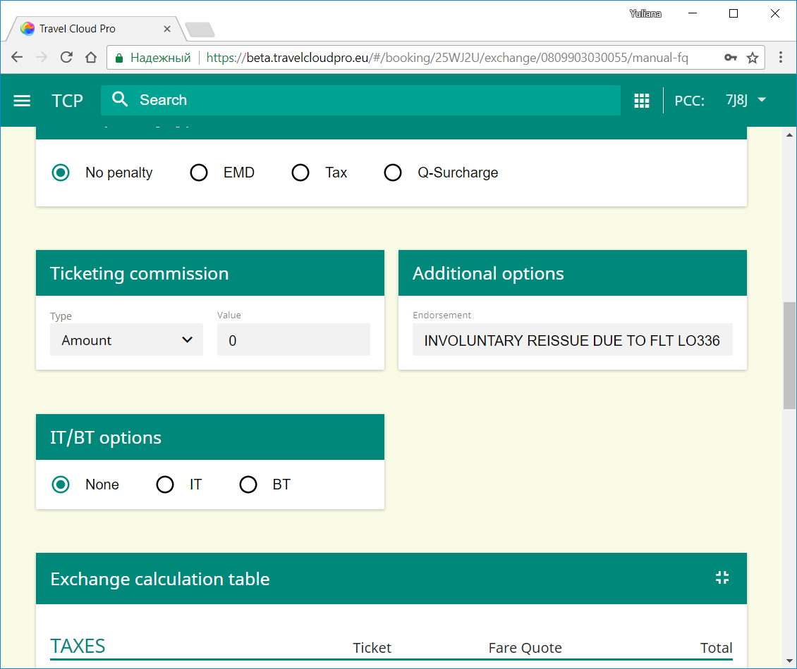

1. Check "Exchange calculation table"

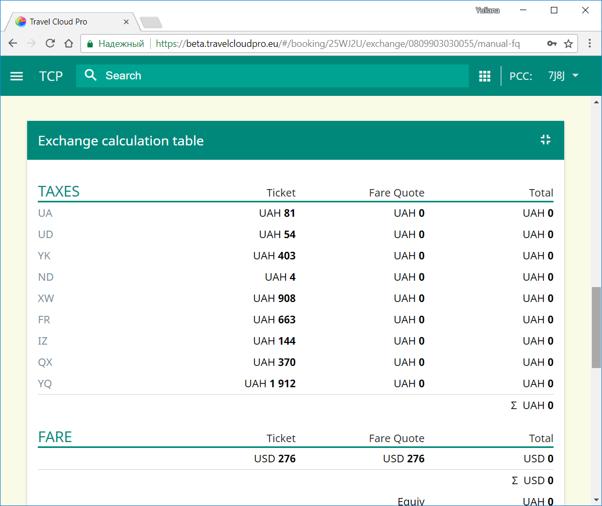

1. Activate toggle boxes for taxes that need to be refunded.
2. Select whether the new ticket should be issued now or later.

The exemplified scenario uses "Issue the ticket now" option. Do not forget to press the green arrow to complete the exchange procedure.

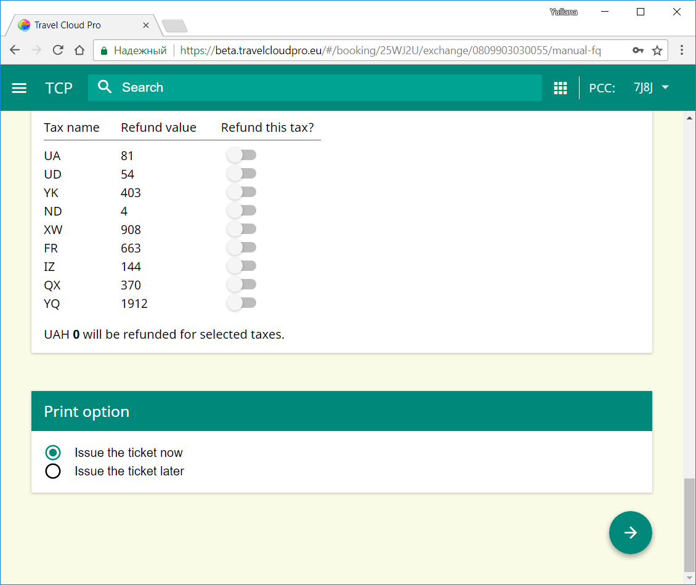10. Verify the Detailed ticket view for newly exchanged ticket by clicking the magnifying glass

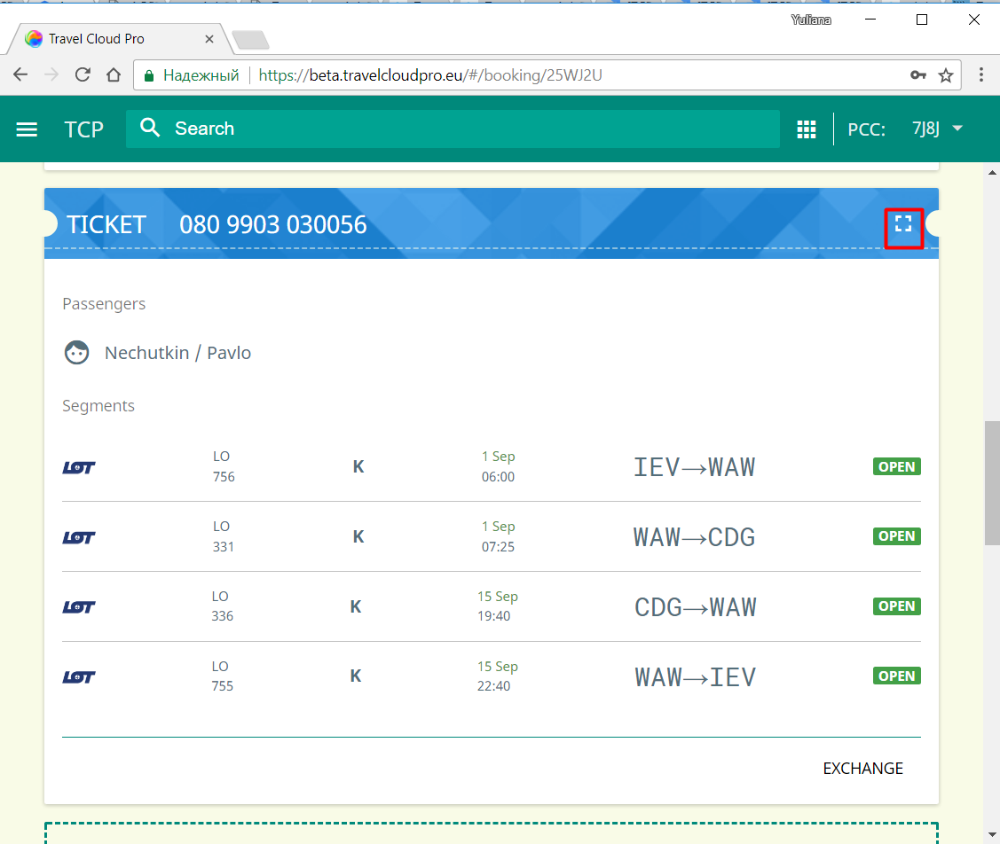

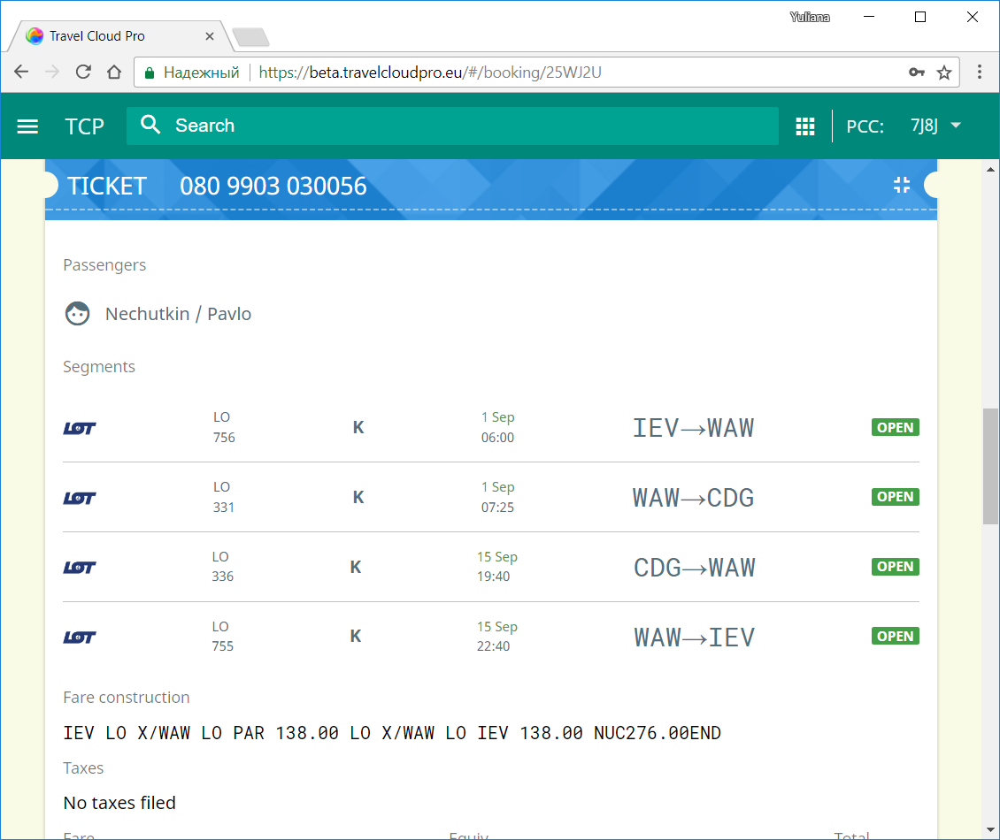

