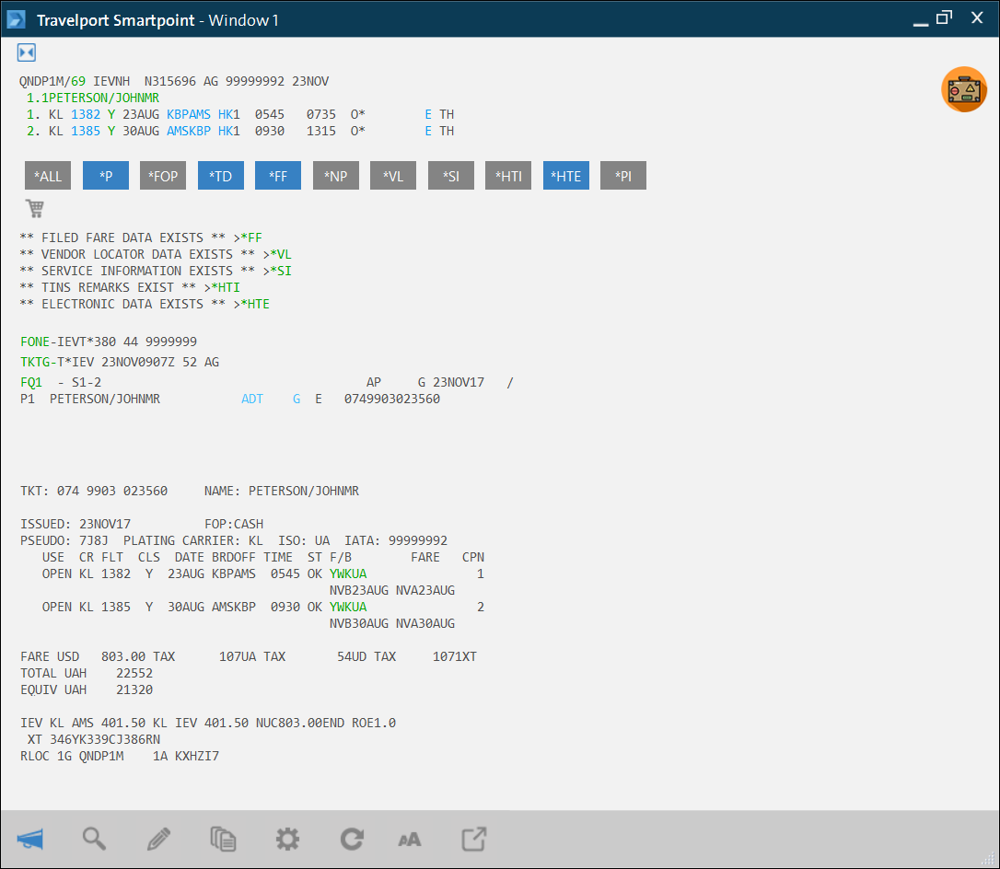
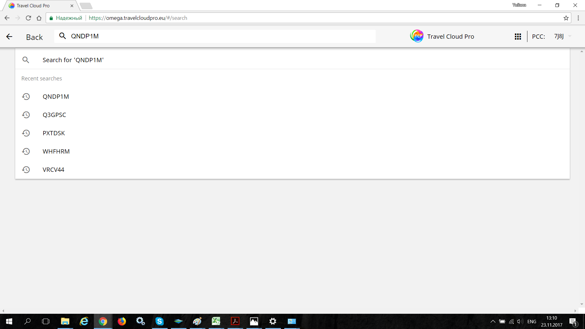
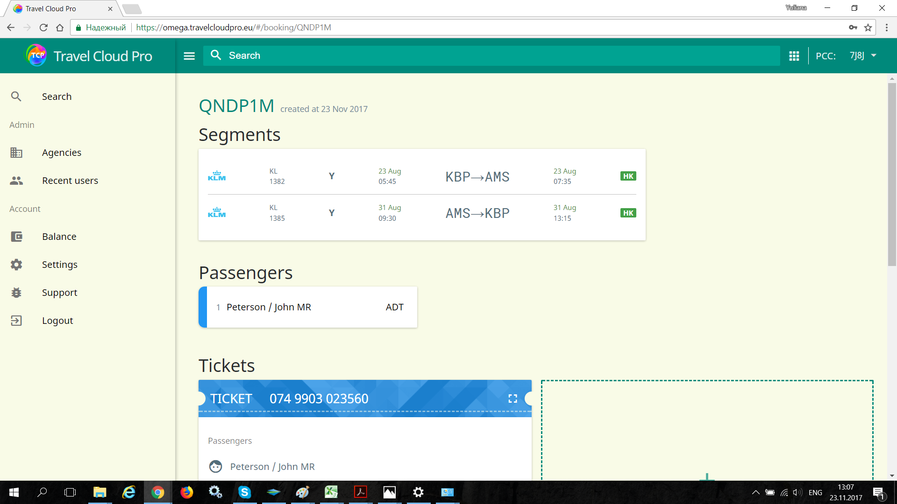
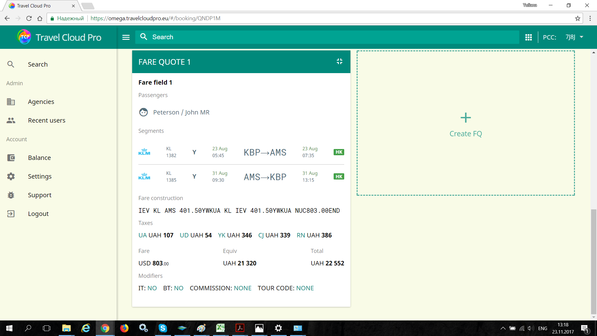
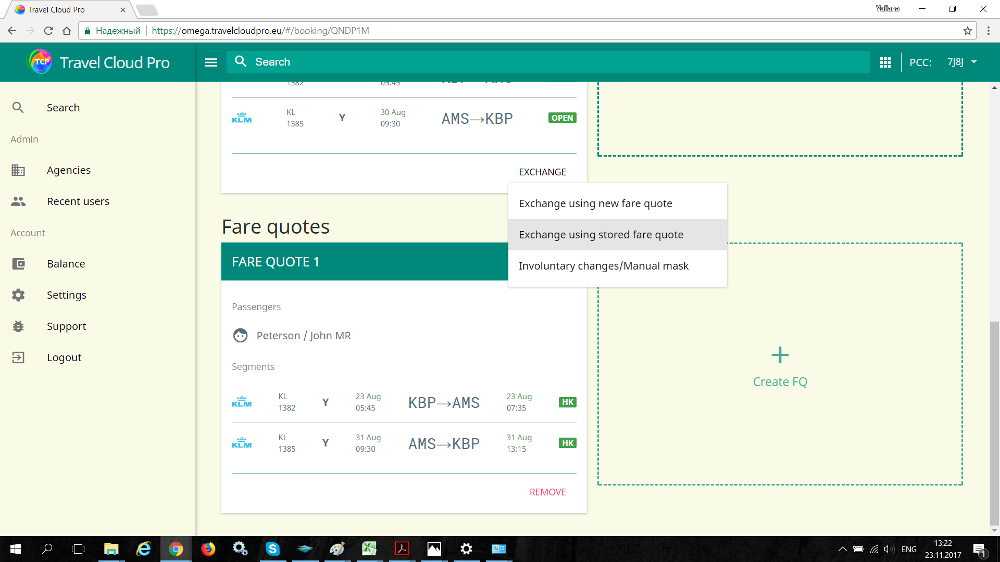
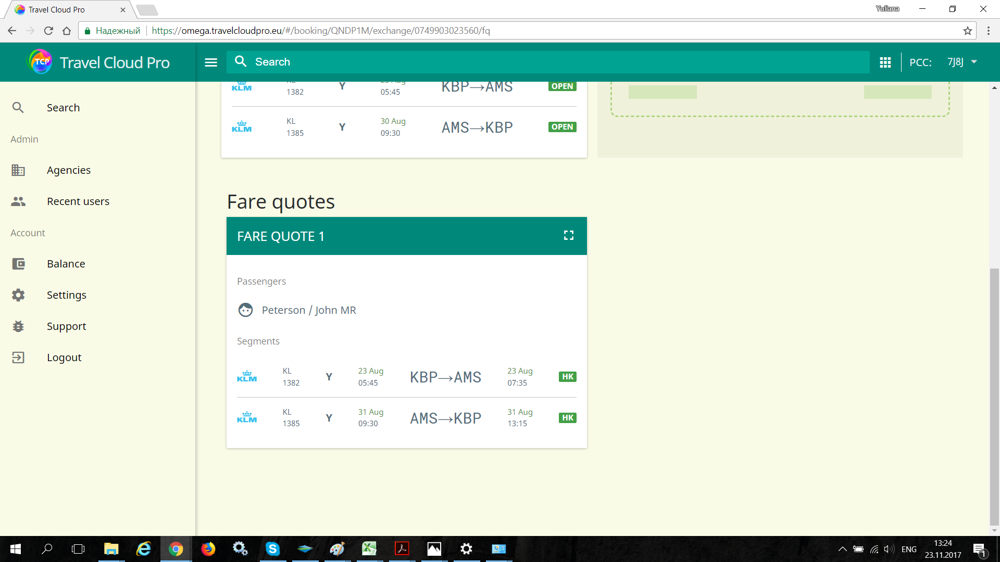
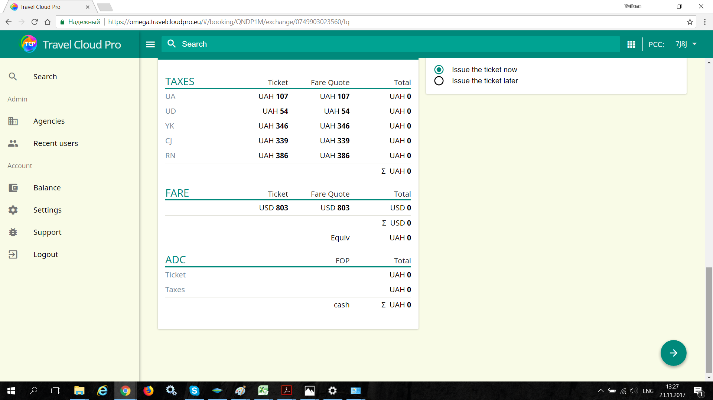
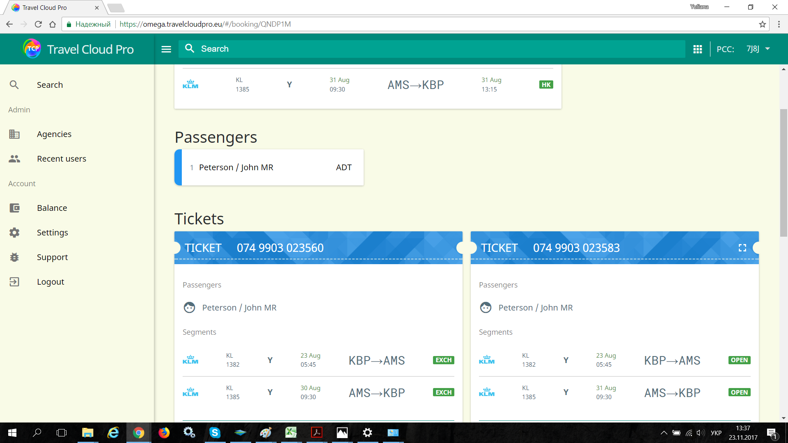

# Exchange using stored fare

## Using stored fare quote

Please find below the workflow how to process an even exchange in TCP using fare quote for revised itinerary already stored in the PNR.

The customer originally ordered a ticket to travel from Kyiv to Amsterdam on the 23 Aug returning from Amsterdam to Kyiv on 30 Aug.

The ticket was originally issued at the fare of USD803.00 plus taxes TAX 107UA, TAX 54UD, TAX 346YK, TAX 339CJ, TAX 386RN

Then the customer decides to change return travel date to the 31st Aug.

1. New itinerary fare quoted using FQ entry, changes saved successfully in Travelport Smartpoint.
2. Open this PNR in TCP by typing the Record locator or Passenger name in Search menu.

TCP displays the revised itinerary, the original ticket details and the new fare quote which has already been stored in this PNR

3. Click on Exchange link on the  and select E-ticket exchange using stored fare quote 

4. Select the fare as per which the ticket should be issued

5. Check the exchange calculation table filled in automatically by TCP. Select "Issue the ticket" and press the arrow button

6. New ticket has been issued without Additional Collection.

