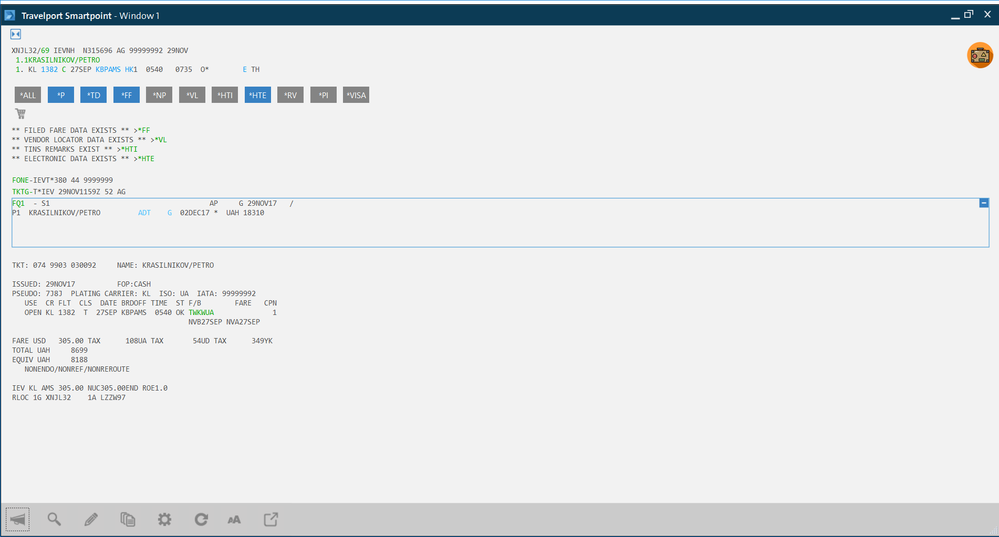
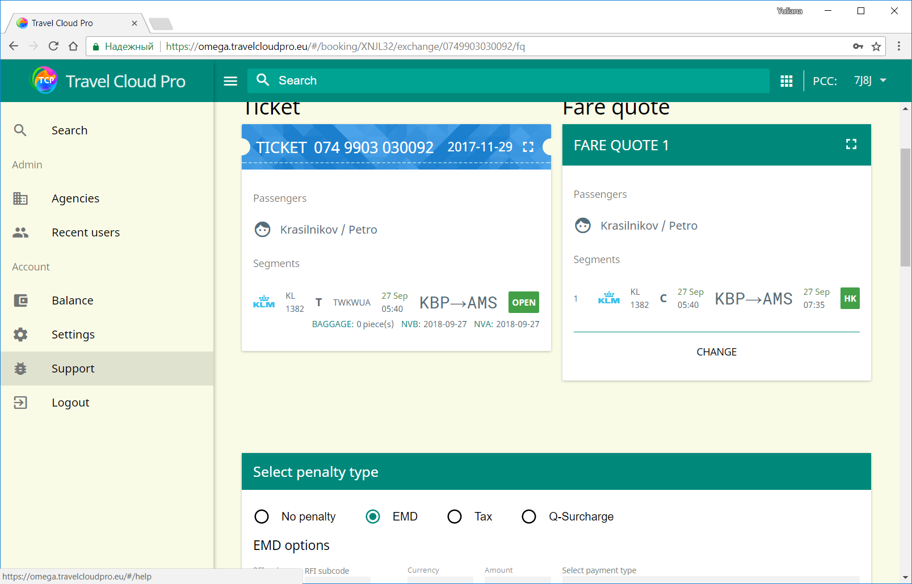
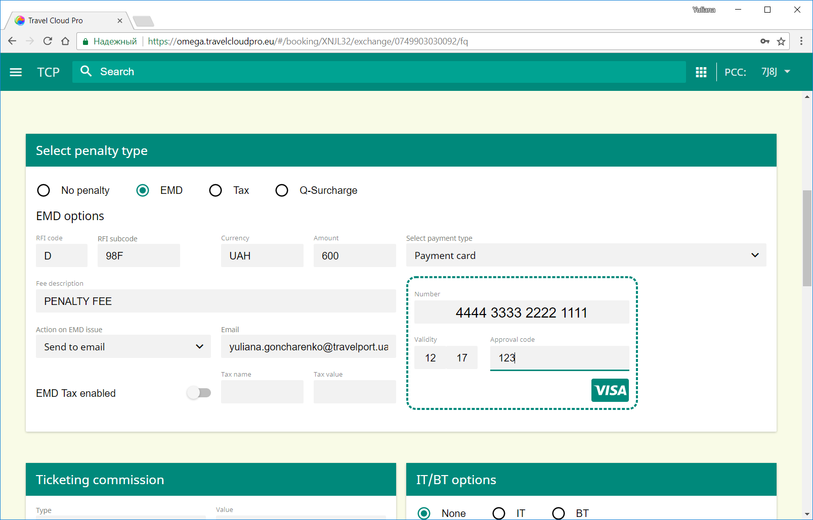
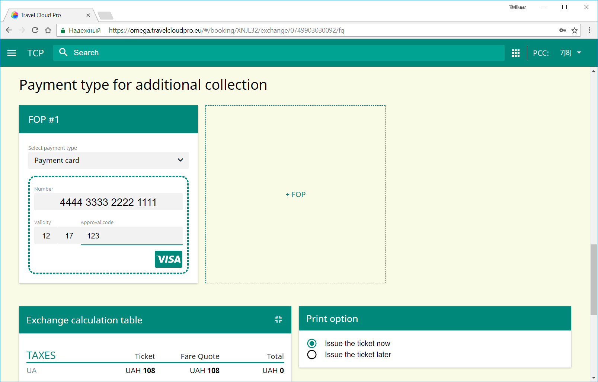
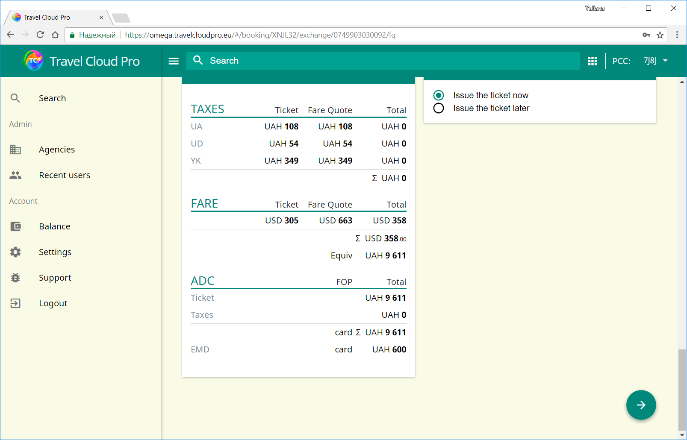
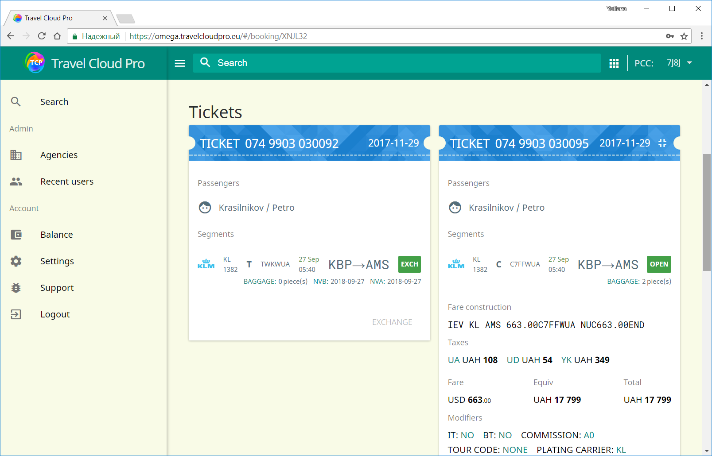

# Exchange with ADC, Penalty charged on EMD

The passenger originally purchased ticket to travel from Kyiv to Amsterdam in economy class on 27 SEP. The ticket was successfully issued at the fare USD 305.00 plus taxes 108UA , 54UD , 349YK.

The passenger than decided to upgrade to business class. The itineary has been changed accordingly, new fare quoted and saved in the PNR

Ticket should be exchanged with ADC for fare. Penalty will be collected on EMD.

To proceed with exchange in TCP the following steps should be taken:

1. Open PNR in TCP
2. Select "Exchange using stored fare quote"
3. Indicate that penalty should be collected on EMD

4. Scroll down to indicate penalty amount. If you would like EMD receipt to be emailed please select "Send to email" in the drop-down menu "Action on EMD issue" and fill in Email field. Otherwise the default "Print locally" option will be used.

5. Select the form of payment for penalty EMD

6. Select the form of payment for penalty

7. Check the exchange calculation table.

8. If you want the new ticket to be issued now, please select the default option "Issue now". If for some reason you want TCP only to build the fare for exchange , opt for "Issue later". In this example we will gor for "Issue now" and click the green arrow to complete exchange procedure.

9.Veryfy the newly issued ticket details in Detailed View

