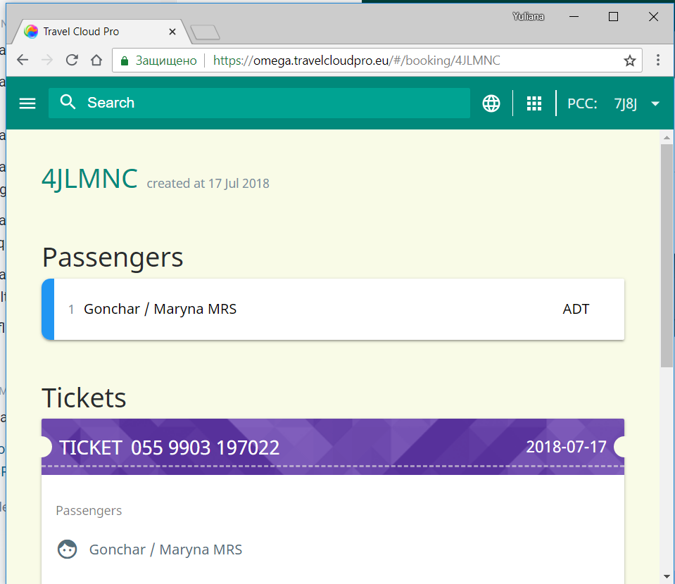

# Remove flight segments in TCP

TCP allows to cancel flight segments directly via TCP interface, including both informative ones and segments booked previously via GDS.

To cancel a segment you need to perform the following steps:

1. Select the flight segments you would like to remove 

2. Confirm your section. Please note that if you select ' YES'this action cannot be undone, flight segments are permanently removed from PNR in GDS: 

