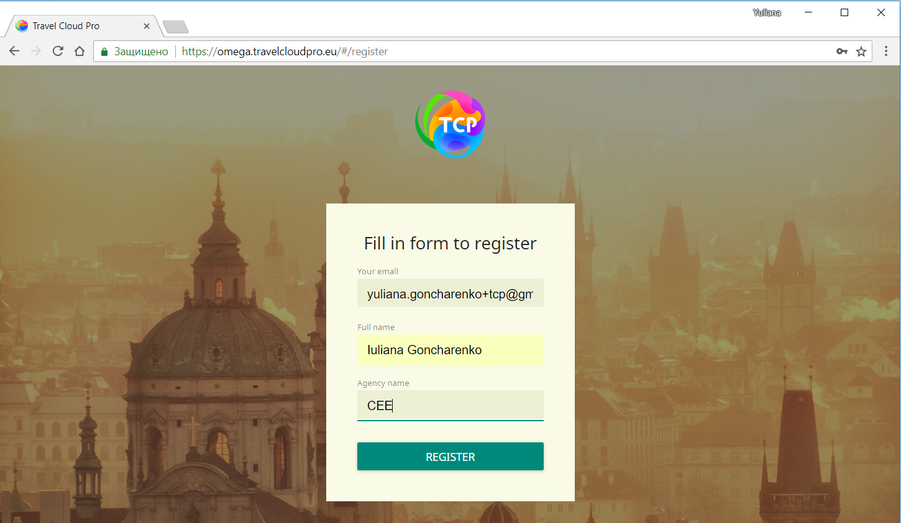
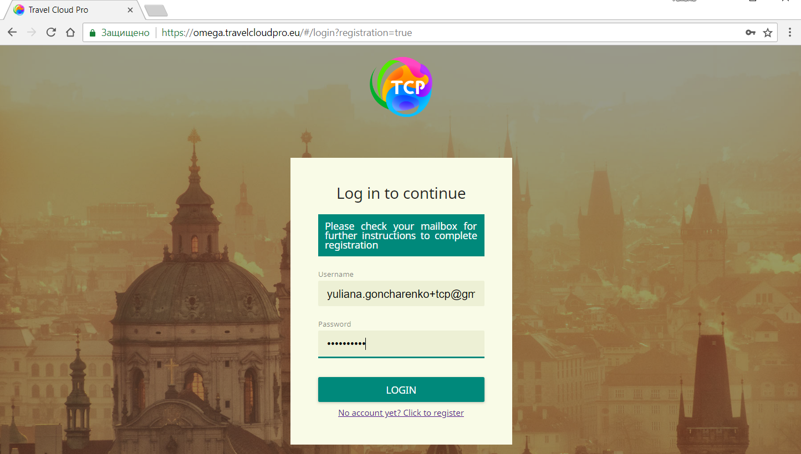
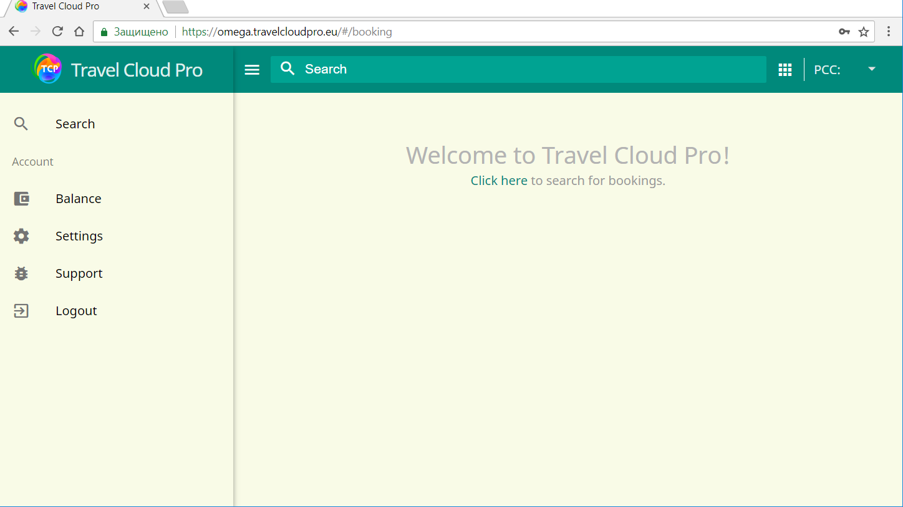

# Create account in TCP

To create a new account in TCP you just need to make 4 simple steps:

1. fill in a simple self registration form available on TCP page:

2. Verify your email address indicated in the registration form. TCP sends the link to confirm the user has access to the email address indicated in the form:

Upon successful email verification TCP displays the relevant notification

3. Insert secret password. TCP password is sent in a separate email message once registration is confirmed. This secret password should be inserted into Login form

Upon successful authorisation TCP Welcome screen is displayed.

User needs to select Settings section to add at least one PCC to TCP account. For more infomation please see subsection [Add PCC to TCP account](../settings/add-pcc-to-tcp-account.md)

