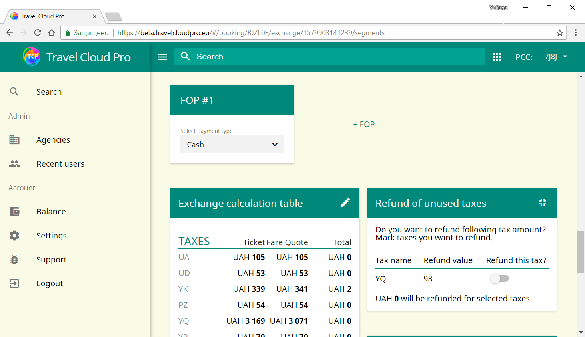

# How to activate Detailed View

TCP shows PNR fields \(Filed Fare Data, Electronic Ticket Data etc\) collapsed by default.

In order to expand it is necessary to click on the expand button in the top right corner of the relevant field.

To collaplse detailed view simply click again on the expand button

Some fields are shown expanded by default, eg Refund of Unused Taxes field

