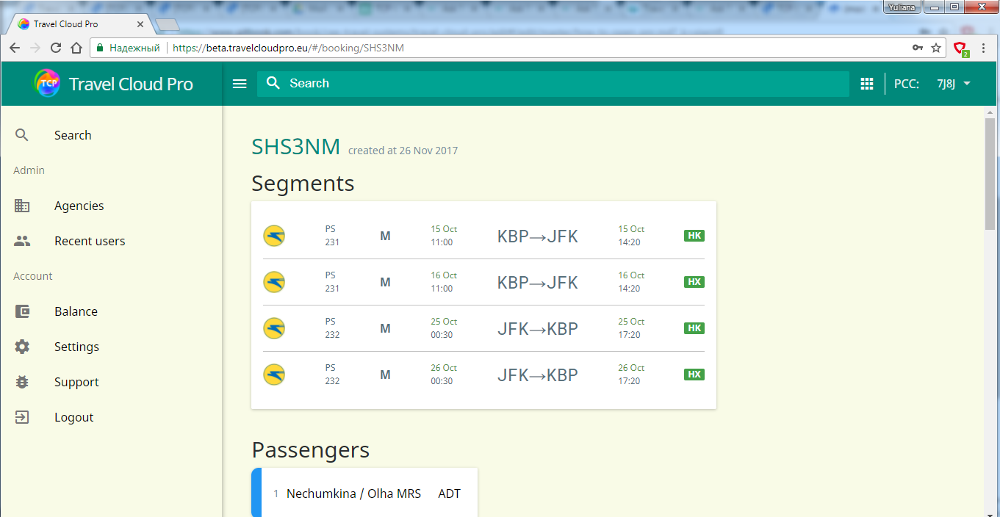
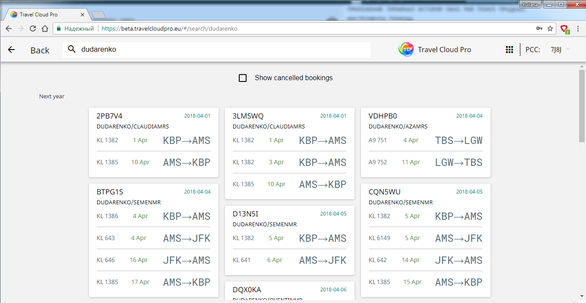

# How to open PNR

To open PNR in TCP simply type Galileo Record locator or Passenger surname in the Search field.

## Search by Record locator

Just type the 6 digit Galileo Record locator into Search filed and press Enter.

TCP retrieves the requested PNR 

## Search by Passenger Name

If you do not remember the PNR locator, use the search by passenger surname.

1. Insert the required surname into Search field

2. Click on the PNR card to display further details and proceed with ticket exchange.

